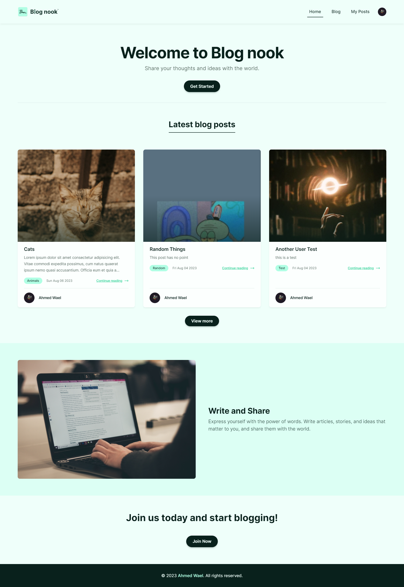

# Blog-nook

## Table of contents

- [Overview](#overview)
  - [Screenshot](#screenshot)
  - [Links](#links)
  - [Technologies](#technologies)

## Overview

- It is a web-based software or service that allows individuals or businesses to create and publish their own blogs on the internet. It provides the necessary tools and features to manage and present content in a blog format, which typically consists of articles or posts organized in reverse chronological order.

### Screenshot

## links

- Live site URL: [Demo](https://blog-nook.vercel.app/blog)

### Technologies

- [React.js](https://react.dev/)
- [TypeScript](https://www.typescriptlang.org/)
- [React Router](https://reactrouter.com/en/main)
- [Redux toolkit](https://redux-toolkit.js.org/)
- [React Qeury](https://tanstack.com/query/latest/)
- [TailwindCSS](https://tailwindcss.com/)
- [Clerk](https://clerk.com/)
- [Firebase](https://firebase.google.com/)
